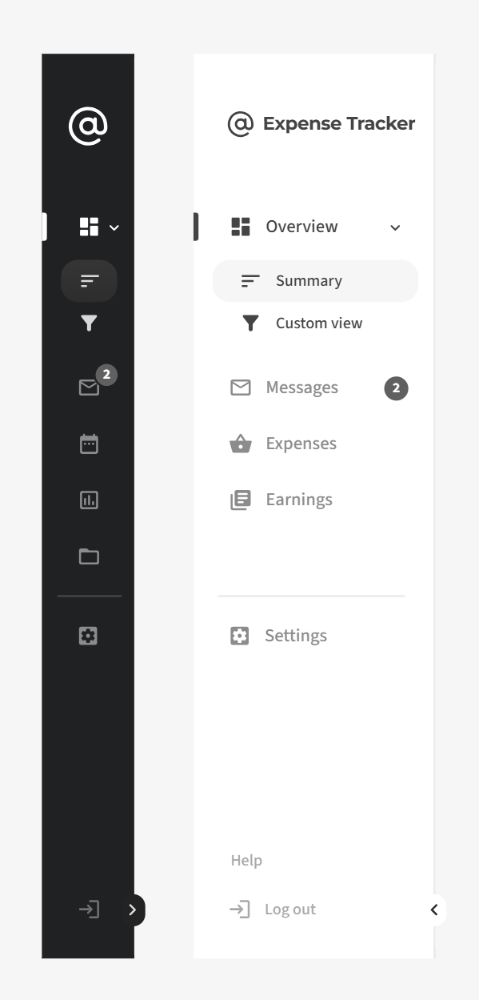
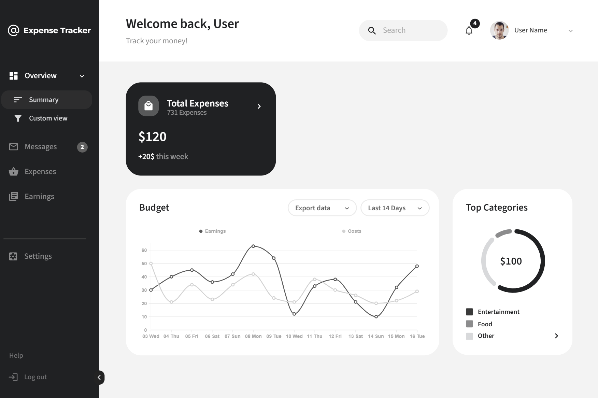
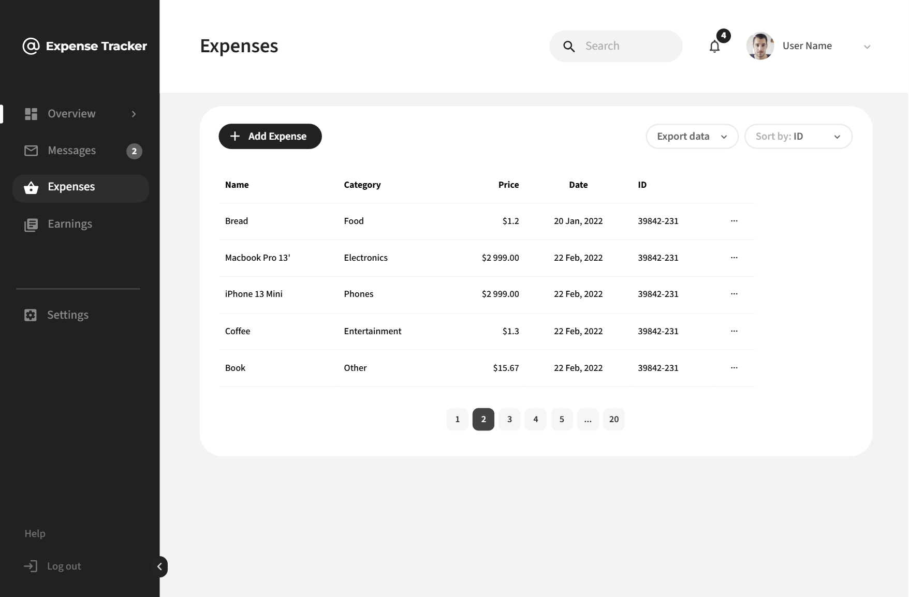
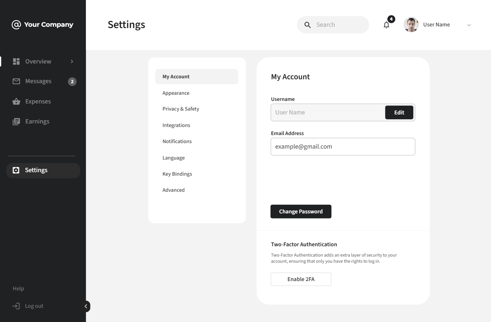
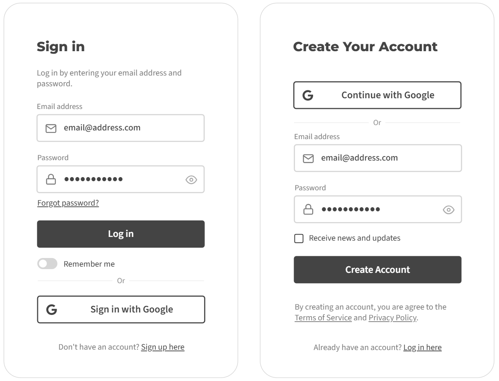
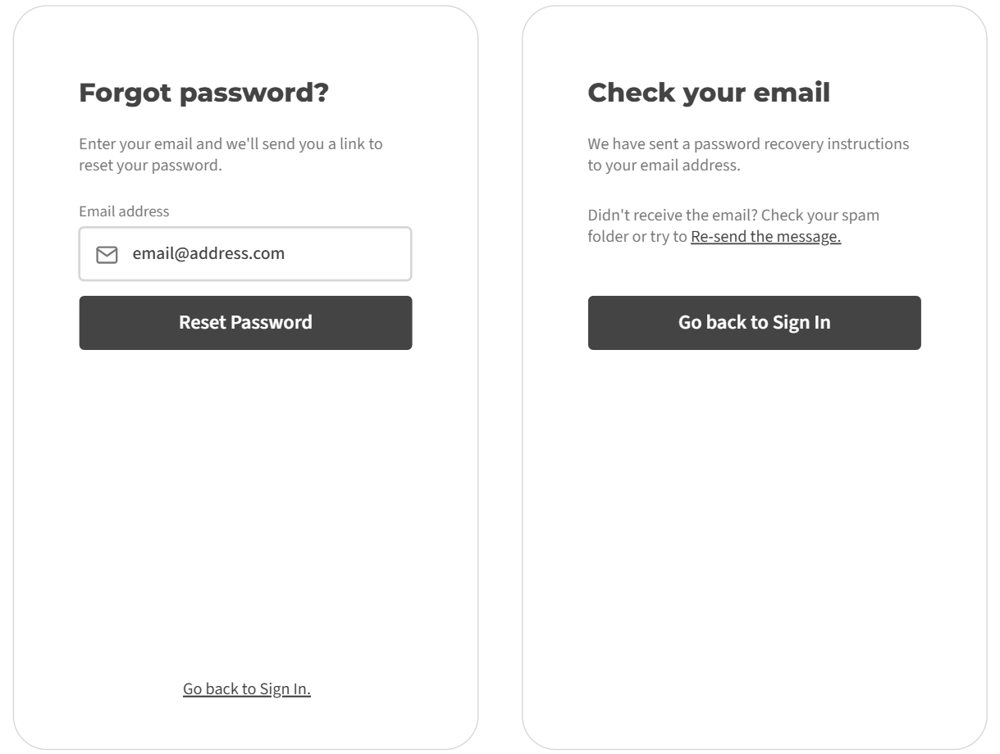
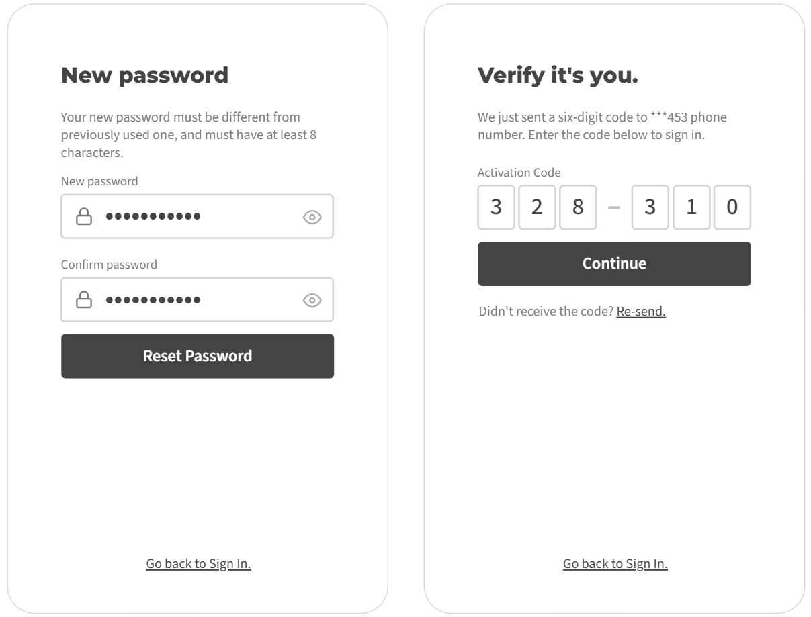

# 📋 System Requirements Specification

## 📑 Содержание
1. [Введение](#intro)  
   1.1 [Назначение](#appointment)  
   1.2 [Бизнес-требования](#business_requirements)  
   1.3 [Аналоги](#analogues)  
2. [Требования пользователя](#user_requirements)  
   2.1 [Программные интерфейсы](#software_interfaces)  
   2.2 [Интерфейс пользователя](#user_interface)  
   2.3 [Характеристики пользователей](#user_specifications)  
   2.4 [Предположения и зависимости](#assumptions_and_dependencies)  
3. [Системные требования](#system_requirements)  
   3.1 [Функциональные требования](#functional_requirements)  
   3.2 [Нефункциональные требования](#non-functional_requirements)  
4. [Эскизы интерфейса](#mockups)  
5. [Технологический стек](#tech_stack)  
6. [Безопасность и производительность](#security_performance)  
7. [Тестирование](#testing)  
8. [Развёртывание](#deployment)

---

## 1. 🧩 Введение

### 1.1 Назначение
Данный документ описывает функциональные и нефункциональные требования к REST-сервису **Expense Tracker**, предназначенному для ведения учёта личных расходов и доходов. Сервис разрабатывается на базе фреймворка Spring и предоставляет API для управления расходами, категориями, бюджетами, напоминаниями и аналитикой.

### 1.2 Бизнес-требования

#### 1.2.1 Исходные данные
Пользователи нуждаются в удобном способе контроля за своими финансами, включая:
- Учёт расходов и доходов
- Категоризацию операций
- Установку бюджетов
- Получение аналитики по тратам
- Напоминания о предстоящих платежах

#### 1.2.2 Возможности проекта
Приложение позволяет:
- Упростить контроль за финансами
- Повысить финансовую грамотность
- Автоматизировать процесс учёта расходов
- Предоставлять аналитику в удобном виде

#### 1.2.3 Доступный функционал
Сервис охватывает:
- CRUD-операции для расходов, категорий, бюджетов и напоминаний
- Импорт/экспорт данных в формате CSV
- Аналитику по расходам и балансу
- Напоминания с поддержкой периодичности

### 1.3 Аналоги
- **Mint** - комплексное решение для управления финансами, но требует регистрации и привязки банковских счетов
- **YNAB (You Need A Budget)** - фокусируется на планировании бюджета, но имеет платную подписку
- **PocketGuard** - упрощенный вариант для контроля расходов, но с ограниченными возможностями API

Данное же приложение имеет упрощённый интерфейс, открытый API и возможность самостоятельного развёртывания.

---

## 2. 👤 Требования пользователя

### 2.1 Программные интерфейсы
- REST API
- Поддержка JSON
- Экспорт/импорт: CSV
- Документация API через Swagger UI

### 2.2 Характеристики пользователей

#### 2.2.1 Аудитория приложения

- **Целевая аудитория**: студенты, молодые специалисты, семьи
- **Побочная аудитория**: предприниматели, фрилансеры

### 2.3 Предположения и зависимости
- Требуется доступ к интернету
- Данные хранятся в реляционной БД (PostgreSQL)

---

## 3. ⚙️ Системные требования

### 3.1 Функциональные требования

#### 3.1.1 Управление расходами
- Создание, редактирование, удаление расходов
- Назначение категории
- Указание даты, суммы, описания

#### 3.1.2 Управление категориями
- CRUD-операции
- Уникальность имени
- Привязка бюджета

#### 3.1.3 Управление бюджетами
- Создание бюджета на месяц
- Привязка к категории
- Контроль превышения

#### 3.1.4 Напоминания
- Создание напоминаний
- Поддержка типов: ONE_TIME, DAILY, WEEKLY, MONTHLY
- Активация/деактивация

#### 3.1.5 Аналитика
- Общий баланс
- Расходы по категориям
- Расходы по дням
- Топ расходов

#### 3.1.6 Импорт/экспорт
- Экспорт расходов в CSV
- Импорт расходов из CSV
- Поддержка категорий и бюджетов

### 3.2 Нефункциональные требования

#### 3.2.1 Безопасность
- Валидация входных данных
- Обработка исключений
- Логирование ошибок

#### 3.2.2 Масштабируемость
- Возможность горизонтального масштабирования
- Поддержка Docker

---

## 4. 🎨 Эскизы интерфейса

### 4.1 Меню

### 4.2 Главный экран

### 4.3 Экран добавления расхода

### 4.4 Настройки

### 4.5 Аутентификация

### 4.6 Восстановление пароля

### 4.7 Верификация пользователя

---

## 5. 🧰 Технологический стек

| Компонент         | Технология |
|------------------|------------|
| Backend           | Spring Boot |
| База данных       | PostgreSQL |
| ORM               | Hibernate |
| Формат данных     | JSON |
| Экспорт/импорт    | OpenCSV |
| Тестирование      | JUnit 5, Mockito |
| Документация API  | Swagger |

---

## 6. 🔐 Безопасность и производительность

- Все входные данные валидируются
- Используется глобальный обработчик исключений
- Ошибки не раскрывают внутреннюю структуру приложения
- Поддержка логирования (SLF4J + Logback)

---

## 7. 🧪 Тестирование

- Юнит-тесты для всех сервисов
- Интеграционные тесты для API
- Тестирование импорта/экспорта CSV
- Проверка валидности данных

---

## 8. 🚀 Развёртывание

- Поддержка Docker и Docker Compose
- Поддержка профилей: `dev`, `prod`
- Возможность развёртывания на VPS / облачных платформах

---

 

> 📌 **Примечание**: Данный SRS-файл может быть дополнен и изменён по мере развития проекта.