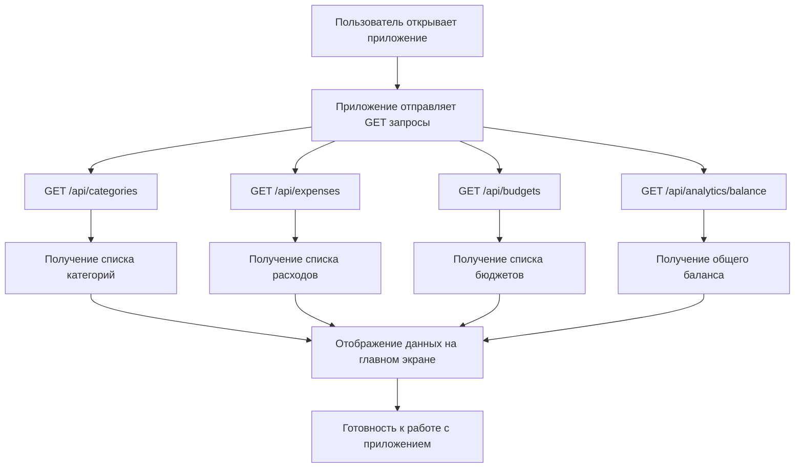
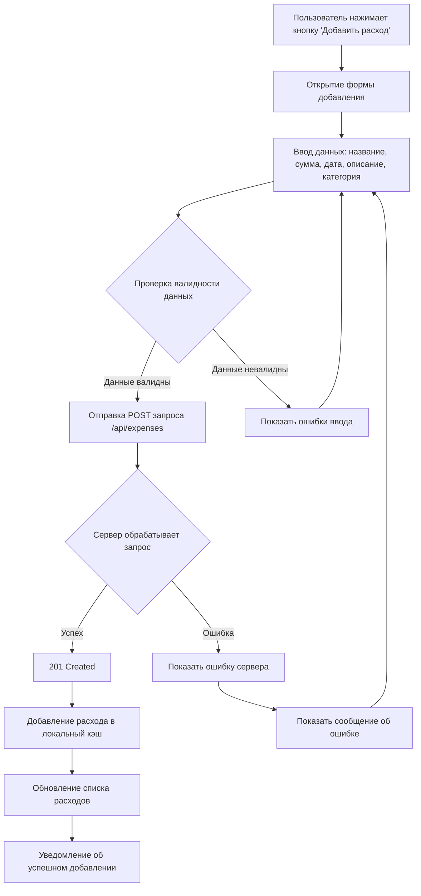
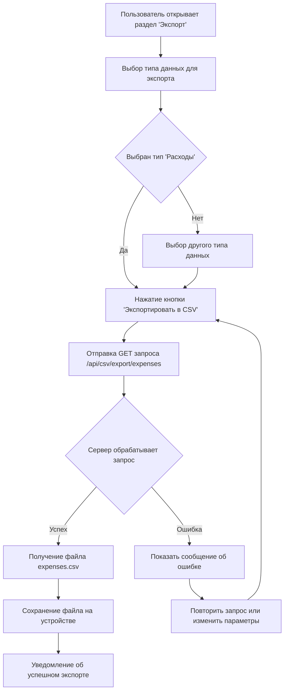

# 📊 Диаграммы активностей

### 1. Загрузка данных

```mermaid
flowchart TD
    A[Пользователь открывает приложение] --> B[Приложение отправляет GET запросы]
    B --> C1[GET /api/categories]
    B --> C2[GET /api/expenses]
    B --> C3[GET /api/budgets]
    B --> C4[GET /api/analytics/balance]
    C1 --> D1[Получение списка категорий]
    C2 --> D2[Получение списка расходов]
    C3 --> D3[Получение списка бюджетов]
    C4 --> D4[Получение общего баланса]
    D1 --> E[Отображение данных на главном экране]
    D2 --> E
    D3 --> E
    D4 --> E
    E --> F[Готовность к работе с приложением]
```

### 2. Добавление расхода

```mermaid
flowchart TD
    A[Пользователь нажимает кнопку 'Добавить расход'] --> B[Открытие формы добавления]
    B --> C[Ввод данных: название, сумма, дата, описание, категория]
    C --> D{Проверка валидности данных}
    D -->|Данные валидны| E[Отправка POST запроса /api/expenses]
    D -->|Данные невалидны| F[Показать ошибки ввода]
    F --> C
    E --> G{Сервер обрабатывает запрос}
    G -->|Успех| H[201 Created]
    G -->|Ошибка| I[Показать ошибку сервера]
    H --> J[Добавление расхода в локальный кэш]
    J --> K[Обновление списка расходов]
    I --> L[Показать сообщение об ошибке]
    L --> C
    K --> M[Уведомление об успешном добавлении]
```

### 3. Экспорт данных в CSV

```mermaid
flowchart TD
    A[Пользователь открывает раздел 'Экспорт'] --> B[Выбор типа данных для экспорта]
    B --> C{Выбран тип 'Расходы'}
    C -->|Да| D[Нажатие кнопки 'Экспортировать в CSV']
    C -->|Нет| E[Выбор другого типа данных]
    E --> D
    D --> F[Отправка GET запроса /api/csv/export/expenses]
    F --> G{Сервер обрабатывает запрос}
    G -->|Успех| H[Получение файла expenses.csv]
    G -->|Ошибка| I[Показать сообщение об ошибке]
    H --> J[Сохранение файла на устройстве]
    J --> K[Уведомление об успешном экспорте]
    I --> L[Повторить запрос или изменить параметры]
    L --> D
```