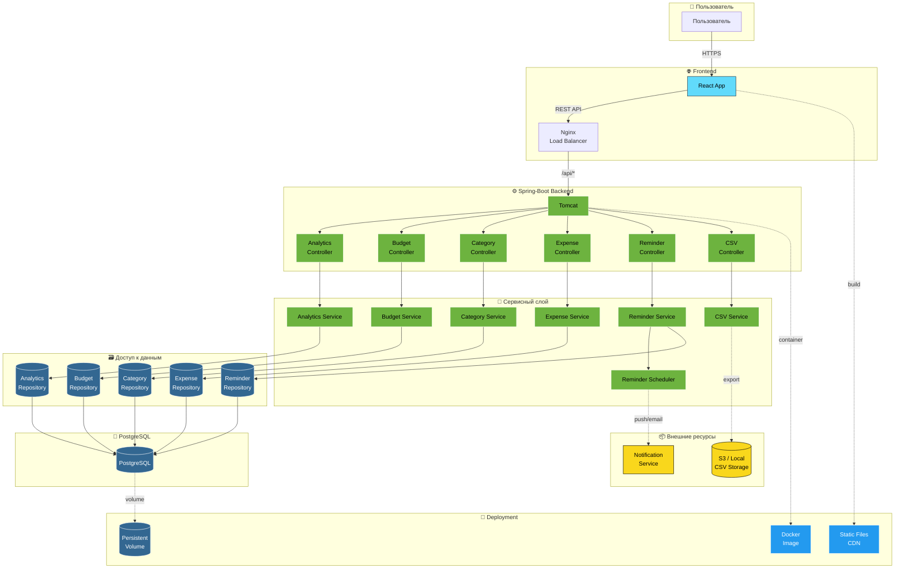

```mermaid
graph TB
    subgraph "👤 Пользователь"
        U[Пользователь]
    end

    %% ---------- Frontend ----------
    subgraph "🌐 Frontend"
        U --> |HTTPS| RA[React App<br/>]
        RA --> |REST API| GLB
    end

    %% ---------- Gateway / LB ----------
    GLB[Nginx<br/>Load Balancer]

    %% ---------- Backend ----------
    subgraph "⚙️ Spring-Boot Backend"
        GLB --> |/api/*| SB[Tomcat]
        SB --> AC[Analytics<br/>Controller]
        SB --> BC[Budget<br/>Controller]
        SB --> CC[Category<br/>Controller]
        SB --> EC[Expense<br/>Controller]
        SB --> RC[Reminder<br/>Controller]
        SB --> CSVC[CSV<br/>Controller]
    end

    %% ---------- Services ----------
    subgraph "🔧 Сервисный слой"
        AC --> AS[Analytics Service]
        BC --> BS[Budget Service]
        CC --> CS[Category Service]
        EC --> ES[Expense Service]
        RC --> RS[Reminder Service]
        CSVC --> CSV[CSV Service]

        RS --> SCH[Reminder Scheduler]
    end

    %% ---------- Repositories ----------
    subgraph "🗃️ Доступ к данным"
        AS --> AR[(Analytics<br/>Repository)]
        BS --> BR[(Budget<br/>Repository)]
        CS --> CR[(Category<br/>Repository)]
        ES --> ER[(Expense<br/>Repository)]
        RS --> RER[(Reminder<br/>Repository)]
    end

    %% ---------- База ----------
    subgraph "🐘 PostgreSQL"
        AR --> DB[(PostgreSQL)]
        BR --> DB
        CR --> DB
        ER --> DB
        RER --> DB
    end

    %% ---------- Внешние компоненты ----------
    subgraph "📦 Внешние ресурсы"
        CSV -.-> |export| CLD[(S3 / Local<br/>CSV Storage)]
        SCH -.-> |push/email| NT[Notification<br/>Service]
    end

    %% ---------- Deployment ----------
    subgraph "🐳 Deployment"
        RA -.-> |build| STAT[Static Files<br/>CDN]
        SB -.-> |container| DOCK[Docker<br/>Image]
        DB -.-> |volume| VOL[(Persistent<br/>Volume)]
    end

    classDef frontend fill:#61dafb,stroke:#282c34,color:#000
    classDef backend fill:#6db33f,stroke:#fff,color:#000
    classDef db fill:#336791,stroke:#fff,color:#fff
    classDef external fill:#f9d71c,stroke:#000,color:#000
    classDef deployment fill:#239aef,stroke:#fff,color:#fff

    class RA frontend
    class SB,AC,BC,CC,EC,RC,CSVC,AS,BS,CS,ES,RS,CSV,SCH backend
    class DB,AR,BR,CR,ER,RER,VOL db
    class CLD,NT external
    class STAT,DOCK deployment
```