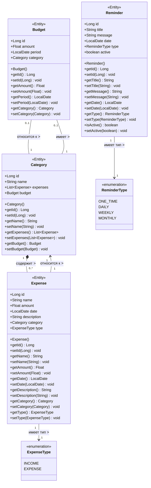

# 📊 Диаграмма классов

```mermaid
classDiagram
    class Budget {
        <<Entity>>
        +Long id
        +Float amount
        +LocalDate period
        +Category category
        +Budget()
        +getId() Long
        +setId(Long) void
        +getAmount() Float
        +setAmount(Float) void
        +getPeriod() LocalDate
        +setPeriod(LocalDate) void
        +getCategory() Category
        +setCategory(Category) void
    }

    class Category {
        <<Entity>>
        +Long id
        +String name
        +List~Expense~ expenses
        +Budget budget
        +Category()
        +getId() Long
        +setId(Long) void
        +getName() String
        +setName(String) void
        +getExpenses() List~Expense~
        +setExpenses(List~Expense~) void
        +getBudget() Budget
        +setBudget(Budget) void
    }

    class Expense {
        <<Entity>>
        +Long id
        +String name
        +Float amount
        +LocalDate date
        +String description
        +Category category
        +ExpenseType type
        +Expense()
        +getId() Long
        +setId(Long) void
        +getName() String
        +setName(String) void
        +getAmount() Float
        +setAmount(Float) void
        +getDate() LocalDate
        +setDate(LocalDate) void
        +getDescription() String
        +setDescription(String) void
        +getCategory() Category
        +setCategory(Category) void
        +getType() ExpenseType
        +setType(ExpenseType) void
    }

    class Reminder {
        <<Entity>>
        +Long id
        +String title
        +String message
        +LocalDate date
        +ReminderType type
        +boolean active
        +Reminder()
        +getId() Long
        +setId(Long) void
        +getTitle() String
        +setTitle(String) void
        +getMessage() String
        +setMessage(String) void
        +getDate() LocalDate
        +setDate(LocalDate) void
        +getType() ReminderType
        +setType(ReminderType) void
        +isActive() boolean
        +setActive(boolean) void
    }

    class ExpenseType {
        <<enumeration>>
        INCOME
        EXPENSE
    }

    class ReminderType {
        <<enumeration>>
        ONE_TIME
        DAILY
        WEEKLY
        MONTHLY
    }

    Category "1" *-- "0..*" Expense : содержит >
    Category "1" -- "0..1" Budget : имеет >
    Budget "0..1" -- "1" Category : относится к >
    Expense "1" --> "1" Category : относится к >
    Expense "1" --> "1" ExpenseType : имеет тип >
    Reminder "1" --> "1" ReminderType : имеет тип >
```