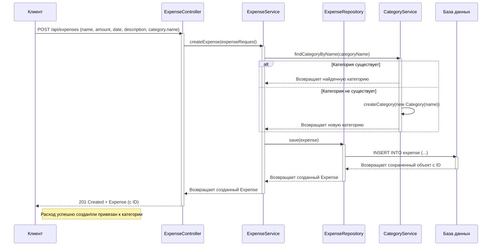

# 📊 Диаграмма последовательности: Создание расхода в Expense Tracker

```mermaid
sequenceDiagram
    participant Client as Клиент
    participant Controller as ExpenseController
    participant Service as ExpenseService
    participant Repository as ExpenseRepository
    participant CategoryService as CategoryService
    participant DB as База данных

    Client->>Controller: POST /api/expenses {name, amount, date, description, category.name}
    activate Controller

    Controller->>Service: createExpense(expenseRequest)
    activate Service

    Service->>CategoryService: findCategoryByName(categoryName)
    activate CategoryService

    alt Категория существует
        CategoryService-->>Service: Возвращает найденную категорию
    else Категория не существует
        CategoryService->>CategoryService: createCategory(new Category(name))
        CategoryService-->>Service: Возвращает новую категорию
    end
    deactivate CategoryService

    Service->>Repository: save(expense)
    activate Repository

    Repository->>DB: INSERT INTO expense (...)
    activate DB

    DB-->>Repository: Возвращает сохраненный объект с ID
    deactivate DB

    Repository-->>Service: Возвращает созданный Expense
    deactivate Repository

    Service-->>Controller: Возвращает созданный Expense
    deactivate Service

    Controller-->>Client: 201 Created + Expense (с ID)
    deactivate Controller

    Note right of Client: Расход успешно создан\nи привязан к категории
```