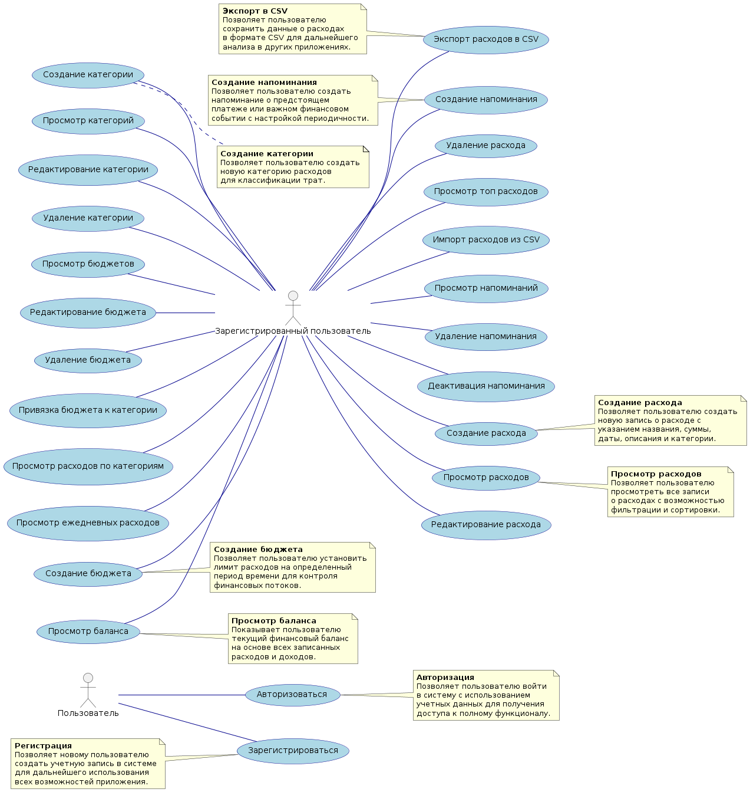

# 📊 Диаграмма вариантов использования

# Глоссарий

| Термин | Определение |
|:--|:--|
| Зарегистрированный ользователь | Человек, авторизованный в системе Expense Tracker |
| Пользователь | Не прошедший авторизацию человек |
| Расход | Запись о потраченных или полученных средствах с указанием суммы, даты и категории |
| Категория | Группа расходов, объединенных по определенному признаку (например, "Продукты", "Транспорт") |
| Бюджет | Лимит расходов на определенную категорию за установленный период времени |
| Напоминание | Уведомление о предстоящем финансовом событии с возможностью настройки периодичности |

# Поток событий

# Содержание
1 [Актёры](#actors)  
2 [Варианты использования](#use_case)  
2.1 [Создание расхода](#create_expense)  
2.2 [Просмотр расходов](#view_expenses)  
2.3 [Редактирование расхода](#edit_expense)  
2.4 [Удаление расхода](#delete_expense)  
2.5 [Создание категории](#create_category)  
2.6 [Просмотр категорий](#view_categories)  
2.7 [Создание бюджета](#create_budget)  
2.8 [Просмотр баланса](#view_balance)  
2.9 [Экспорт расходов в CSV](#export_csv)  
2.10 [Импорт расходов из CSV](#import_csv)  
2.11 [Создание напоминания](#create_reminder)  
2.12 [Просмотр напоминаний](#view_reminders)  

# 1 Актёры

| Актёр | Описание |
|:--|:--|
| Зарегистрированный пользователь | Вошедший в систему пользователь, управляющий своими личными финансами |
| Пользователь | Не выполнивший вход в систему человек |

# 2 Варианты использования

## 2.1 Создание расхода

**Описание.** Вариант использования "Создание расхода" позволяет пользователю добавить новую запись о расходе в систему.  
**Предусловия.** Пользователь находится в интерфейсе управления расходами.  
**Основной поток.**
1. Пользователь нажимает кнопку "Добавить расход";
2. Система отображает форму для ввода данных расхода (название, сумма, дата, описание, категория);
3. Пользователь заполняет форму и подтверждает ввод;
4. Система проверяет валидность данных;
5. Система сохраняет расход в базе данных;
6. Система обновляет отображение списка расходов;
7. Вариант использования завершается.

**Дополнительная информация.** Пользователь может отменить создание расхода в любой момент до подтверждения ввода.

**Альтернативный поток А1.**
1. Система обнаруживает невалидные данные (например, отрицательная сумма);
2. Система отображает сообщение об ошибке с указанием невалидных полей;
3. Пользователь исправляет данные или отменяет операцию.

## 2.2 Просмотр расходов

**Описание.** Вариант использования "Просмотр расходов" позволяет пользователю увидеть список всех записанных расходов.  
**Предусловия.** Система загружена и готова к работе.  
**Основной поток.**
1. Пользователь переходит в раздел "Расходы";
2. Система отправляет запрос на получение списка расходов;
3. Система получает данные от сервера;
4. Система отображает список расходов в табличном виде;
5. Вариант использования завершается.

**Дополнительная информация.** Пользователь может применять фильтры по дате, категории или сумме.

## 2.3 Редактирование расхода

**Описание.** Вариант использования "Редактирование расхода" позволяет пользователю изменить данные существующего расхода.  
**Предусловия.** Пользователь выбрал расход из списка для редактирования.  
**Основной поток.**
1. Пользователь нажимает кнопку "Редактировать" для выбранного расхода;
2. Система отображает форму с текущими данными расхода;
3. Пользователь вносит изменения и подтверждает их;
4. Система проверяет валидность измененных данных;
5. Система сохраняет обновленные данные расхода;
6. Система обновляет отображение списка расходов;
7. Вариант использования завершается.

**Альтернативный поток А1.**
1. Система обнаруживает невалидные данные;
2. Система отображает сообщение об ошибке с указанием невалидных полей;
3. Пользователь исправляет данные или отменяет операцию.

## 2.4 Удаление расхода

**Описание.** Вариант использования "Удаление расхода" позволяет пользователю удалить запись о расходе из системы.  
**Предусловия.** Пользователь выбрал расход из списка для удаления.  
**Основной поток.**
1. Пользователь нажимает кнопку "Удалить" для выбранного расхода;
2. Система отображает подтверждение удаления;
3. Пользователь подтверждает удаление;
4. Система отправляет запрос на удаление расхода;
5. Система получает подтверждение об успешном удалении;
6. Система обновляет отображение списка расходов;
7. Вариант использования завершается.

**Альтернативный поток А1.**
1. Пользователь отменяет подтверждение удаления;
2. Система закрывает окно подтверждения;
3. Вариант использования завершается без изменений.

## 2.5 Создание категории

**Описание.** Вариант использования "Создание категории" позволяет пользователю добавить новую категорию для классификации расходов.  
**Предусловия.** Пользователь находится в разделе управления категориями.  
**Основной поток.**
1. Пользователь нажимает кнопку "Добавить категорию";
2. Система отображает форму для ввода названия категории;
3. Пользователь вводит название и подтверждает ввод;
4. Система проверяет, что категория с таким названием не существует;
5. Система сохраняет новую категорию в базе данных;
6. Система обновляет отображение списка категорий;
7. Вариант использования завершается.

**Альтернативный поток А1.**
1. Система обнаруживает, что категория с таким названием уже существует;
2. Система отображает сообщение об ошибке;
3. Пользователь вводит новое название или отменяет операцию.

## 2.6 Просмотр категорий

**Описание.** Вариант использования "Просмотр категорий" позволяет пользователю увидеть список всех созданных категорий расходов.  
**Предусловия.** Система загружена и готова к работе.  
**Основной поток.**
1. Пользователь переходит в раздел "Категории";
2. Система отправляет запрос на получение списка категорий;
3. Система получает данные от сервера;
4. Система отображает список категорий;
5. Вариант использования завершается.

## 2.7 Создание бюджета

**Описание.** Вариант использования "Создание бюджета" позволяет пользователю установить лимит расходов на определенную категорию.  
**Предусловия.** Пользователь находится в разделе управления бюджетами.  
**Основной поток.**
1. Пользователь нажимает кнопку "Создать бюджет";
2. Система отображает форму для ввода данных бюджета (сумма, период);
3. Пользователь заполняет форму и подтверждает ввод;
4. Система проверяет валидность данных;
5. Система сохраняет бюджет в базе данных;
6. Система предлагает привязать бюджет к категории;
7. Пользователь выбирает категорию и подтверждает привязку;
8. Система сохраняет связь бюджета с категорией;
9. Вариант использования завершается.

**Альтернативный поток А1.**
1. Пользователь отказывается от привязки к категории;
2. Система сохраняет бюджет без привязки;
3. Вариант использования завершается.

## 2.8 Просмотр баланса

**Описание.** Вариант использования "Просмотр баланса" позволяет пользователю увидеть текущий финансовый баланс.  
**Предусловия.** Система загружена и содержит данные о расходах.  
**Основной поток.**
1. Пользователь переходит в раздел "Аналитика";
2. Система отправляет запрос на получение общего баланса;
3. Система получает данные от сервера;
4. Система отображает текущий баланс;
5. Вариант использования завершается.

## 2.9 Экспорт расходов в CSV

**Описание.** Вариант использования "Экспорт расходов в CSV" позволяет пользователю сохранить данные о расходах в формате CSV.  
**Предусловия.** Пользователь находится в разделе экспорта данных.  
**Основной поток.**
1. Пользователь нажимает кнопку "Экспортировать в CSV";
2. Система отправляет запрос на генерацию CSV-файла;
3. Сервер формирует CSV-файл с данными о расходах;
4. Сервер возвращает файл пользователю;
5. Браузер автоматически запускает скачивание файла;
6. Вариант использования завершается.

## 2.10 Импорт расходов из CSV

**Описание.** Вариант использования "Импорт расходов из CSV" позволяет пользователю импортировать данные о расходах из CSV-файла.  
**Предусловия.** Пользователь находится в разделе импорта данных.  
**Основной поток.**
1. Пользователь нажимает кнопку "Импортировать из CSV";
2. Система предлагает выбрать CSV-файл;
3. Пользователь выбирает файл и подтверждает импорт;
4. Система отправляет файл на сервер;
5. Сервер обрабатывает CSV-файл и импортирует данные;
6. Система отображает отчет об успешном импорте;
7. Вариант использования завершается.

**Альтернативный поток А1.**
1. Система обнаруживает ошибки в формате CSV-файла;
2. Система отображает сообщение об ошибке с описанием проблемы;
3. Пользователь исправляет файл или отменяет операцию.

## 2.11 Создание напоминания

**Описание.** Вариант использования "Создание напоминания" позволяет пользователю создать напоминание о предстоящем финансовом событии.  
**Предусловия.** Пользователь находится в разделе управления напоминаниями.  
**Основной поток.**
1. Пользователь нажимает кнопку "Создать напоминание";
2. Система отображает форму для ввода данных напоминания (заголовок, сообщение, дата, тип);
3. Пользователь заполняет форму и подтверждает ввод;
4. Система проверяет валидность данных;
5. Система сохраняет напоминание в базе данных;
6. Система настраивает расписание для напоминания;
7. Вариант использования завершается.

## 2.12 Просмотр напоминаний

**Описание.** Вариант использования "Просмотр напоминаний" позволяет пользователю увидеть список всех созданных напоминаний.  
**Предусловия.** Система загружена и содержит данные о напоминаниях.  
**Основной поток.**
1. Пользователь переходит в раздел "Напоминания";
2. Система отправляет запрос на получение списка напоминаний;
3. Система получает данные от сервера;
4. Система отображает список напоминаний с указанием статуса и даты;
5. Вариант использования завершается.